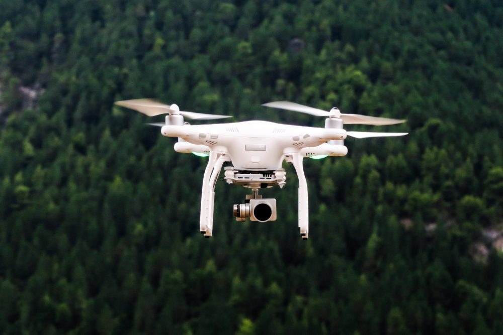

之前自己工作之后的一些感想，也算一些对生活的吐槽和感想，本该不该放在这里，但是觉得不管怎样是自己的一种记录，还是要放在这里，以后做一种对比记录吧。

*DJI Phantom 4*

### 工作与生活
- 最近一直处于一阵工作认真，一阵沾沾自喜，迷茫与工作和生活的两个问题不断的纠结，想做好多事情，每件事情去做的时候，又缺乏动力，我知道基础很重要要多看书，来沉淀自己，组建自己的技术知识网络，但是还是想的总归是想的，做的总归是做的，做的时候永远是那么无趣。对于这一点我知道对自己打击过大，因为不管给自己和给别人的感觉永远是我工作能力不强和为人做事不够好，对于和他人相处，还是一点尽量不要以自己的情绪和喜好去影像他人吧，慢慢的让自己有所规划

- 对以后的自己希望有所改变吧，慢慢的沉淀下去，抓住时间，少一些抱怨和空想，其实我知道我在空谈一些事情，但这些确实是我所想的事情，就这些吧。

- 之前还觉得对与文章这些事情，就像说话一样，只是把说话变成写作就好了，但是真正做起来的时候，还是差距挺大的，以后还是写作这件事情，没有害怕什么，写出来，其实你不是你想象的那么伟大，你=只是在逃避而已

- 今天想改变一下自己的一指禅写法，发现自己的手还是不行，哈哈哈，改变一下哈，今天写到这里吧，以后再记录